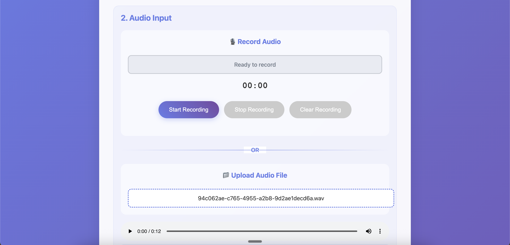

# Neural Network Training

# Online Demo

## V2A Project

Please visit the following link to see the online demo for the V2A project. You will have to upload an ONNX model and an audio file to see the output. For the ONNX model please download the ONNX model from the following link:

https://github.com/sanjuhs/NN_training/tree/main/assets

from the assets folder, please download the ONNX model and put it in the root directory of the project.

Here is the link to the online demo:

https://nn-training.vercel.app/

# Project Overview

The objective of this Neural Network Training directory is for me to do all my Neural Network training on this and to follow a bunch of different projects that I'd like to. The first and primary project that I'll be following through on will be the project where I will be converting voice into blend shapes. Basically I will take input voice of a person and from that I will infer a bunch of 52 numbers that will control the blend shape of a character. So, given some speech, the character will speak with that speech and will get animated with those specific blend shapes and that's the minor objective of this Neural Network Training that I'll do. My constraints are:

1. It should be a small neural network
2. It should be real-time
3. It should be very low compute It should be as low as possible.

So basically I'm trying to create a very tiny neural network that will convert voice into blend shapes that's the objective. Now according to Feasibility is the voice rich enough to actually give enough information to generate the blend shapes? I think yes. If so, you will also need something to embed the voice and the context of the voice itself because that would then help convey emotion of how the AI actor or the animated character should act or something like that. So I'm not sure about these parts but before we answer those difficult questions, I'm going to try to first overfit or create a very simple neural network and overfit it. The other part is to just give you some updates, I have already created an older neural network which is basically temporal convolutional neural network with the help of cloud. And I think I've messed it up and it's not working properly so to diagnose how it's working we are going to first overtrain it on a very simple training data set and we're going to make sure everything is working smooth and fine and then only we will move to the next stage.

I will also try my best to have a Kaggle notebook wherever possible so that I can share the link to it and you all can replicate all the results that I have. I will also keep uploading this on Github and make this as public as possible so people can see the updates as and when they're happening.

## Current Status

All of the material related to this animation project is called the Voice-to-Animation project or V2A project. It will be named as V2A-project-subname, so any folder with that will be the nomenclature for you to go and check what is in that folder's training code and what that folder's code actually does.

This repository is structured as a monorepo of sorts, containing all my neural network experiments. Please forgive me if it's a bit disorganized, but I've tried to organize it as much as possible.

I will also be using one large virtual environment, and I will keep doing a pip freeze. So we will load that virtual environment and we will use that specifically for almost all of the projects.

I'll also make sure that each of the folders has its own README file so that you can read that and understand or get an overview of what's going on in that specific folder, and it's relatively well organized there.

My current repo is a M1 Mac, so my current work system is an M1 Mac. And if you have it, you should be able to replicate it fairly, simply, or easily.

THe output of the V2A project is as follows:

The output of the V2A project is as follows:
