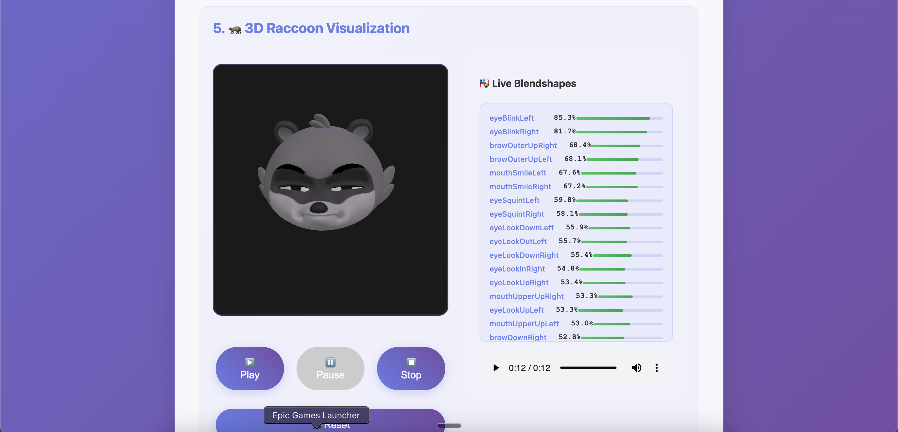
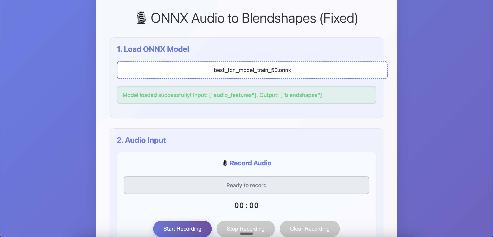
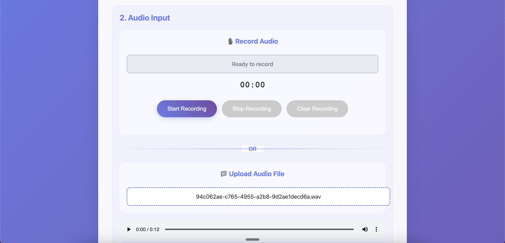

### Voice-to-Action (Audio-to-Blendshapes) – Quick Guide

This demo shows how we convert audio to facial blendshapes and render a character (raccoon head) in the browser.

### How it works

1. The model is a causal TCN trained to map 80-dim log-mel features (100 Hz) to 52 MediaPipe blendshapes + 7 head pose values.
2. Inference runs at 100 Hz, then we downsample predictions to 30 fps for rendering.
3. The web demo loads the ONNX model, accepts an audio file or recording, runs inference, and renders the face from the generated JSON.

### Pipeline docs

- See `Objectives.md` for project scope and goals.
- See `Architecture.md` for data extraction, synchronization, model details, training, and inference.

### Screenshots

